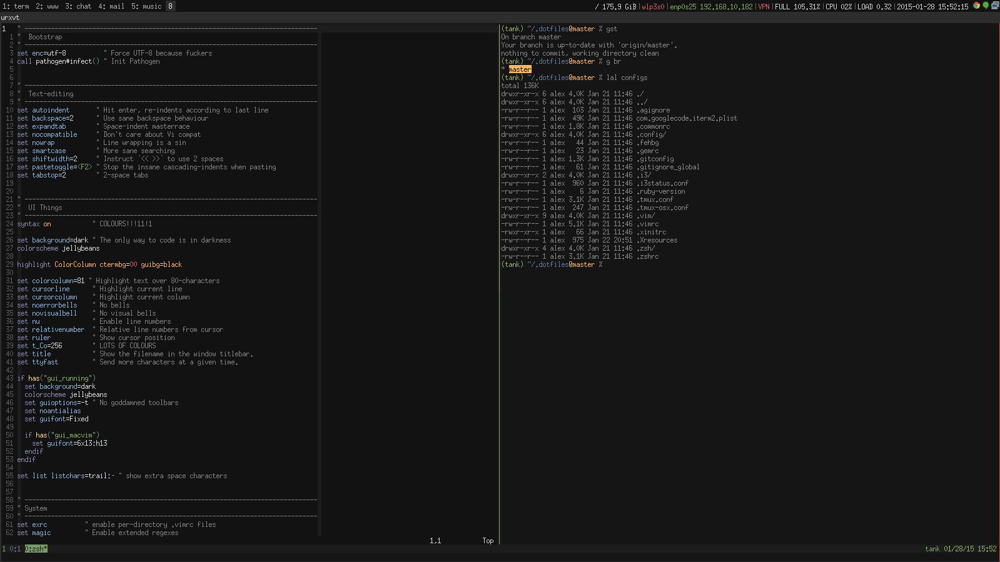

# ~/.dotfiles/

This is what I use every day for work, play, and everything else.

Setup is fairly simple; check out the `Makefile`, or just run:

```bash
$ make && make clean install
```

**NOTE**: if you have any existing files with the same name, they'll be
destroyed by the `clean` make target.

The Makefile simply copies the files out of the repo folder and into `~/`. This
allows you to, for example, add passwords to configuration files, without
accidentally committing them or being annoyed by constant untracked changes (as
would be the case if you symlinked them).

## Preview



## OSX

There is a tiny amendment for tmux for OS X to get the pasteboard working
properly, so if you're installing these on OS X you'll need to run one extra
make target.

```bash
$ make osxclean osxinstall
```

Generally I don't patch anything specifically for a platform, but copy-paste is
kind of important so I made an exception.
